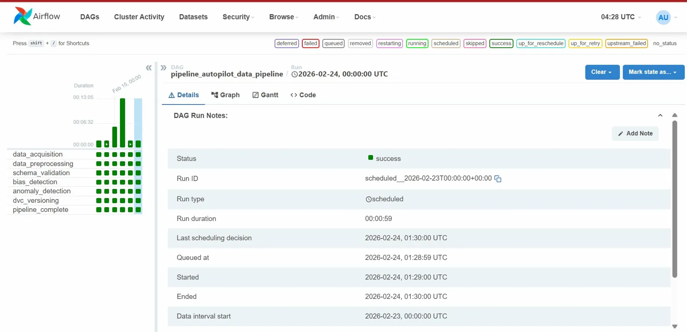
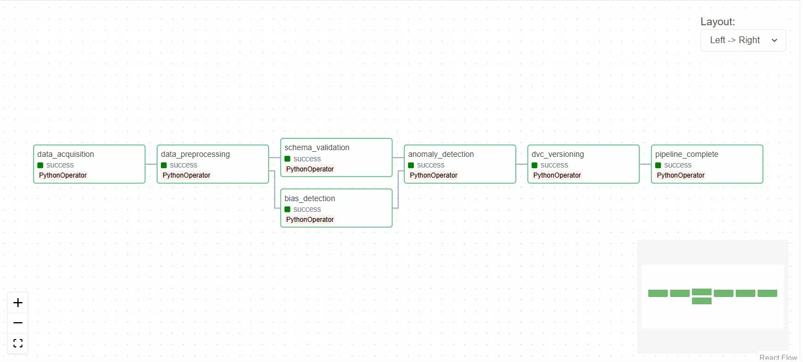
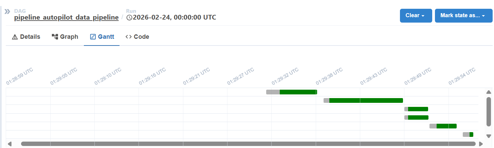

# 🚀 Pipeline Autopilot

**MLOps CI/CD Pipeline Failure Prediction System**

[](https://www.python.org/downloads/)
[](https://airflow.apache.org/)
[](https://www.docker.com/)

---

## 📋 Table of Contents

1. [Project Overview](#-project-overview)
2. [How to Replicate](#-how-to-replicate-step-by-step-setup)
3. [How to Run the Pipeline](#-how-to-run-the-pipeline)
4. [How to Run Tests](#-how-to-run-tests)
5. [Project Structure](#-project-structure)
6. [Pipeline Architecture](#-pipeline-architecture)
7. [Dataset Information](#-dataset-information)
8. [Data Versioning with DVC](#-data-versioning-with-dvc)
9. [Bias Detection & Mitigation](#-bias-detection--mitigation)
10. [Team Members](#-team-members)

---

## 📖 Project Overview

**Pipeline Autopilot** is an MLOps system that predicts CI/CD pipeline failures before they happen using Machine Learning, and explains root causes using RAG (Retrieval-Augmented Generation).

### Problem Statement
- Data pipelines fail unexpectedly → engineers waste hours debugging
- Manual monitoring is inefficient and reactive
- No proactive failure prevention exists

### Our Solution
- **Predict** pipeline failures before execution using ML models
- **Warn** users with probability scores
- **Explain** root causes using RAG
- **Suggest** fixes based on historical patterns

### Key Features
- ✅ Automated data acquisition and preprocessing
- ✅ Schema validation and statistics generation
- ✅ Anomaly detection with alerts
- ✅ Bias detection using data slicing
- ✅ Data versioning with DVC
- ✅ Full pipeline orchestration with Apache Airflow
- ✅ Comprehensive logging and error handling
- ✅ Unit tests for all components

---

## 🔧 How to Replicate (Step-by-Step Setup)

Follow these instructions to set up the project on your machine.

### Prerequisites

| Software | Version | Download Link |
|----------|---------|---------------|
| Python | 3.10+ | [python.org](https://www.python.org/downloads/) |
| Docker Desktop | Latest | [docker.com](https://www.docker.com/products/docker-desktop/) |
| Git | Latest | [git-scm.com](https://git-scm.com/downloads) |

### Step 1: Clone the Repository

```bash
git clone https://github.com/anita2210/pipeline-autopilot.git
cd pipeline-autopilot
```

### Step 2: Create Environment File

Create a `.env` file in the project root:

```bash
# For Windows PowerShell:
echo "AIRFLOW_UID=50000" > .env

# For Mac/Linux:
echo "AIRFLOW_UID=$(id -u)" > .env
```

### Step 3: Install Python Dependencies (Optional - for local development)

```bash
# Create virtual environment
python -m venv venv

# Activate virtual environment
# Windows:
venv\Scripts\activate
# Mac/Linux:
source venv/bin/activate

# Install dependencies
pip install -r requirements.txt
```

### Step 4: Verify Setup

```bash
# Test configuration
python scripts/config.py
```

Expected output:
```
============================================================
PIPELINE AUTOPILOT CONFIGURATION
============================================================
✅ All directories verified/created!
✅ Raw dataset found: .../data/raw/final_dataset.csv
```

---

## ▶️ How to Run the Pipeline

### Step 1: Start Docker Desktop

Make sure Docker Desktop is running (check for "Engine running" status).

### Step 2: Start Airflow

```bash
cd pipeline-autopilot

# Start all services
docker-compose up -d
```

Wait 2-3 minutes for all containers to initialize.

### Step 3: Verify Containers are Running

```bash
docker-compose ps
```

Expected output:
```
NAME                           STATUS
pipeline_autopilot_postgres    Up (healthy)
pipeline_autopilot_scheduler   Up (healthy)
pipeline_autopilot_triggerer   Up (healthy)
pipeline_autopilot_webserver   Up (healthy)
```

### Step 4: Access Airflow Web UI

1. Open browser: **http://localhost:8080**
2. Login credentials:
   - **Username:** `admin`
   - **Password:** `admin`

### Step 5: Run the DAG

1. Find DAG: `pipeline_autopilot_data_pipeline`
2. Enable the DAG (toggle switch ON)
3. Click **Play ▶️** button → **Trigger DAG**
4. Click on DAG name → **Graph** tab to watch execution

### Step 6: Monitor Pipeline Execution

All 7 tasks should complete successfully (green):

```
data_acquisition      ✅
data_preprocessing    ✅
schema_validation     ✅ (parallel)
bias_detection        ✅ (parallel)
anomaly_detection     ✅
dvc_versioning        ✅
pipeline_complete     ✅
```

### Step 7: Stop Airflow (when done)

```bash
docker-compose down
```

---

## 🧪 How to Run Tests

### Run All Tests

```bash
# Make sure you're in the project directory
cd pipeline-autopilot

# Activate virtual environment (if using)
# Windows:
venv\Scripts\activate
# Mac/Linux:
source venv/bin/activate

# Run all tests
pytest tests/ -v
```

### Run Specific Test Files

```bash
# Test data preprocessing
pytest tests/test_data_preprocessing.py -v

# Test schema validation
pytest tests/test_schema_validation.py -v

# Test anomaly detection
pytest tests/test_anomaly_detection.py -v

# Test logging configuration
pytest tests/test_logging_config.py -v
```

### Run Tests with Coverage Report

```bash
pytest tests/ -v --cov=scripts --cov-report=html
```

### Expected Test Output

```
tests/test_data_preprocessing.py::test_load_data PASSED
tests/test_data_preprocessing.py::test_handle_missing_values PASSED
tests/test_schema_validation.py::test_validate_schema PASSED
tests/test_anomaly_detection.py::test_detect_anomalies PASSED
...
================= X passed in Y.YYs =================
```

---

## 📁 Project Structure

```
pipeline-autopilot/
│
├── dags/
│   └── pipeline_dag.py              # Main Airflow DAG (7 tasks)
│
├── scripts/
│   ├── config.py                    # Central configuration
│   ├── data_acquisition.py          # Data loading & validation
│   ├── data_preprocessing.py        # Data cleaning & transformation
│   ├── schema_validation.py         # Schema & statistics generation
│   ├── anomaly_detection.py         # Outlier detection & alerts
│   ├── bias_detection.py            # Bias analysis using data slicing
│   ├── dvc_versioning.py            # Data version control
│   └── logging_config.py            # Logging configuration
│
├── data/
│   ├── raw/                         # Raw dataset
│   ├── processed/                   # Cleaned dataset
│   ├── schema/                      # Schema & statistics JSON files
│   └── reports/                     # Bias detection reports (PNG)
│
├── tests/
│   ├── conftest.py                  # Test fixtures
│   ├── test_data_preprocessing.py   # Preprocessing tests
│   ├── test_schema_validation.py    # Schema validation tests
│   ├── test_anomaly_detection.py    # Anomaly detection tests
│   └── test_logging_config.py       # Logging tests
│
├── logs/                            # Airflow logs
│
├── .dvc/                            # DVC configuration
├── dvc.yaml                         # DVC pipeline definition
├── dvc.lock                         # DVC lock file
│
├── docker-compose.yaml              # Airflow Docker setup
├── requirements.txt                 # Python dependencies
├── .gitignore                       # Git ignore rules
├── .env                             # Environment variables
└── README.md                        # This file
```

---

## 🔄 Pipeline Architecture

### DAG Flow Diagram

```
┌──────────────────┐
│ data_acquisition │
└────────┬─────────┘
         │
         ▼
┌────────────────────┐
│ data_preprocessing │
└────────┬───────────┘
         │
    ┌────┴────┐
    │         │
    ▼         ▼
┌─────────┐ ┌─────────────┐
│ schema  │ │    bias     │  ← PARALLEL EXECUTION
│validation│ │  detection  │
└────┬────┘ └──────┬──────┘
     │             │
     └──────┬──────┘
            │
            ▼
   ┌─────────────────┐
   │anomaly_detection│
   └────────┬────────┘
            │
            ▼
   ┌─────────────────┐
   │  dvc_versioning │
   └────────┬────────┘
            │
            ▼
   ┌─────────────────┐
   │pipeline_complete│
   └─────────────────┘
```

### Pipeline Execution Screenshots

#### Pipeline Status & Task History
All 7 tasks completed successfully with multiple successful runs:



#### Graph View - DAG Structure
Shows parallel execution of `schema_validation` and `bias_detection`:



#### Gantt Chart - Execution Timeline
Visualizes task duration and parallel execution:



### Task Details

| Task | Description | Duration |
|------|-------------|----------|
| `data_acquisition` | Load raw CSV, validate columns | ~5 sec |
| `data_preprocessing` | Clean, transform, encode | ~5-13 min |
| `schema_validation` | Generate schema & statistics | ~5 sec |
| `bias_detection` | Analyze bias across features | ~5 sec |
| `anomaly_detection` | Detect outliers using Z-score/IQR | ~7 sec |
| `dvc_versioning` | Version control processed data | ~3 sec |
| `pipeline_complete` | Generate summary report | ~2 sec |

---

## 📊 Dataset Information

### Overview

The project uses a **preprocessed dataset** generated by `data_preprocessing.py` from the raw CI/CD pipeline logs.

| Property | Value |
|----------|-------|
| **File** | `data/processed/final_dataset_processed.csv` |
| **Total Rows** | 149,967 |
| **Total Columns** | 32 |
| **Target Variable** | `failed` (binary: 0/1) |
| **Failure Rate** | ~11.33% |

### Data Pipeline Flow

```
Raw Data                          Preprocessed Data
(final_dataset.csv)        →     (final_dataset_processed.csv)
150,000 rows x 26 cols           149,967 rows x 32 cols
                           ↑
                  data_preprocessing.py
                  - Handle missing values
                  - Remove duplicates (33 removed)
                  - Encode categoricals (+6 new cols)
                  - Validate constraints
                  - Cap outliers
```

### Column Descriptions

| Category | Columns |
|----------|---------|
| **ID** | run_id |
| **Datetime** | trigger_time |
| **Temporal** | day_of_week, hour, is_weekend |
| **Performance** | duration_seconds, avg_duration_7_runs, duration_deviation |
| **Historical** | prev_run_status, failures_last_7_runs, workflow_failure_rate, hours_since_last_run |
| **Complexity** | total_jobs, failed_jobs, retry_count, concurrent_runs |
| **Risk** | head_branch, is_main_branch, is_first_run, is_bot_triggered, trigger_type |
| **Categorical** | pipeline_name, repo, failure_type, error_message |
| **Target** | failed |

### Preprocessing Applied

| Step | Description |
|------|-------------|
| Missing Values | Median for numerical, mode for categorical |
| Duplicates | Removed based on `run_id` |
| Datetime Parsing | `trigger_time` converted to datetime |
| Categorical Encoding | Frequency encoding for high-cardinality, label encoding for low-cardinality |
| Outlier Capping | IQR method (1.5x multiplier) |
| Constraint Validation | `failed_jobs <= total_jobs`, `workflow_failure_rate` between 0-1 |

---

## 📦 Data Versioning with DVC

### Initialize DVC (already done)

```bash
dvc init
```

### Track Data Files

```bash
dvc add data/raw/final_dataset.csv
dvc add data/processed/final_dataset_processed.csv
```

### Push to Remote Storage

```bash
# Configure remote (Google Cloud Storage)
dvc remote add -d gcs_remote gs://your-bucket-name

# Push data
dvc push
```

### Pull Data on Another Machine

```bash
dvc pull
```

### View Data Version History

```bash
dvc diff
```

---

## ⚖️ Bias Detection & Mitigation

### Approach

We use **data slicing** to analyze model performance across different subgroups.

### Features Analyzed for Bias

| Feature | Type | Slices |
|---------|------|--------|
| `repo` | Categorical | 50 repositories |
| `pipeline_name` | Categorical | Multiple pipelines |
| `trigger_type` | Categorical | push, pull_request, schedule, etc. |
| `is_weekend` | Binary | Weekend vs Weekday |
| `is_bot_triggered` | Binary | Bot vs Human |

### Bias Reports Generated

- `data/reports/bias_repo.png`
- `data/reports/bias_pipeline_name.png`
- `data/reports/bias_trigger_type.png`
- `data/reports/bias_is_weekend.png`
- `data/reports/bias_is_bot_triggered.png`

### Findings & Mitigation

1. **Class Imbalance:** Target variable has ~11% failure rate
   - Mitigation: Use stratified sampling, class weights in model training

2. **Repository Bias:** Some repos have higher failure rates
   - Mitigation: Include repo as a feature, monitor per-repo performance

3. **Temporal Bias:** Weekend runs may behave differently
   - Mitigation: Include is_weekend as a feature

---

## 👥 Team Members

| Member | Role | Responsibilities |
|--------|------|------------------|
| Member 1 | Pipeline Architect | Folder structure, config.py, Airflow DAG, Docker setup |
| Member 2 | Data Engineer | Data acquisition scripts |
| Member 3 | Data Scientist | Data preprocessing, feature engineering |
| Member 4 | Quality Engineer | Schema validation, anomaly detection |
| Member 5 | MLOps Engineer | DVC versioning, bias detection |
| Member 6 | Test Engineer | Unit tests, logging configuration |

---

## 📞 Troubleshooting

### Common Issues

**1. Docker containers not starting**
```bash
docker-compose down
docker-compose up -d
```

**2. Airflow UI not accessible**
- Wait 2-3 minutes after starting containers
- Check: `docker-compose ps` (all should show "healthy")

**3. DAG not visible in Airflow**
- Check for syntax errors: `python dags/pipeline_dag.py`
- Restart scheduler: `docker-compose restart airflow-scheduler`

**4. Tests failing**
- Ensure virtual environment is activated
- Install dependencies: `pip install -r requirements.txt`

---

## 📄 License

This project is for educational purposes (MLOps Course Project - February 2026).

---

## 🔗 Links

- **GitHub Repository:** https://github.com/anita2210/pipeline-autopilot
- **Airflow UI:** http://localhost:8080 (when running)

---

